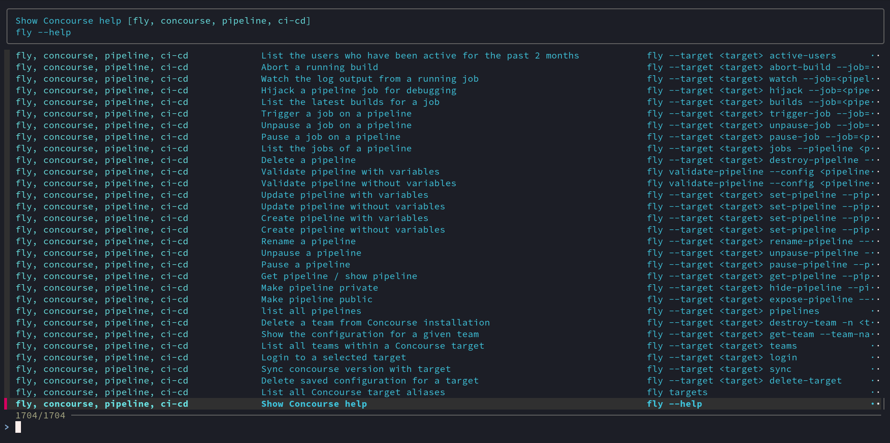

# R511-TP4+ - Navi CheatSheet

## Installation

Pour installer Navi, on peut faire:

```sh
dnf install navi
```

## Configuration

Après avoir activé Navi, on peut "l'activer" en ajoutant:

```sh
eval "$(navi widget bash)"
```

dans notre `.bashrc`.

> [!NOTE]
> Par défaut, Navi utilise <kbd>Ctrl+G</kbd>



### Ajout d'un dépôt de cheatsheets

```sh
navi repo add git@github.com:iut-beziers/navi-cheatsheet-alexis-opolka
```

#### Auto-reload de nos cheat-sheets

On crée un service et un timer systemd:

- `navi-tp.service`:

    ```conf
    [Unit]
    Description=Simple pull to update Navi's cheatsheet
    After=navi-tp.timer

    [Service]
    Type=oneshot
    ExecStart=/usr/local/navi/navi-tp-reload.sh
    ```

- `navi-tp.timer`:

    ```conf
    [Unit]
    Description=A timer for the navi-tp.service

    [Timer]
    OnUnitActiveSec=60s
    OnBootSec=300s

    [Install]
    WantedBy=timers.target
    ```

## Cheat Sheets

Vous pouvez voir les cheat sheets ici: [src/cheatsheet](./src/cheatsheet/)
